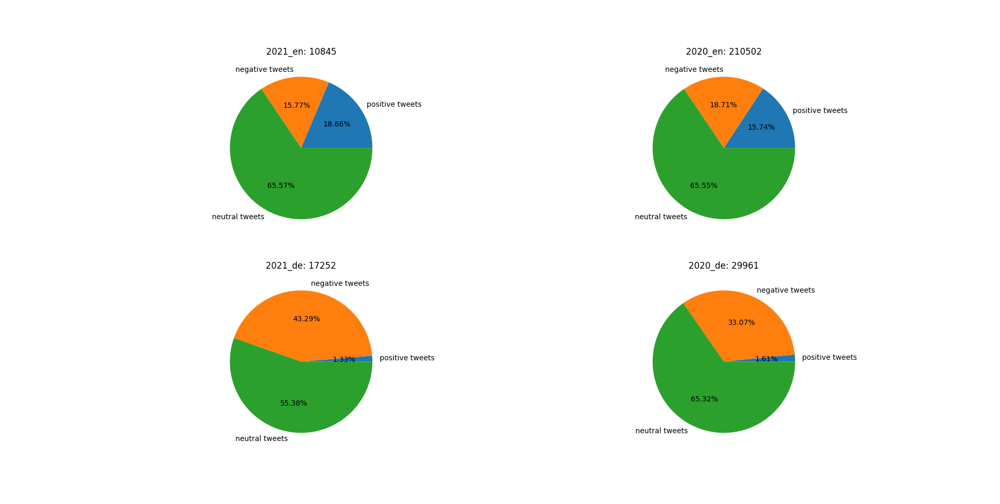
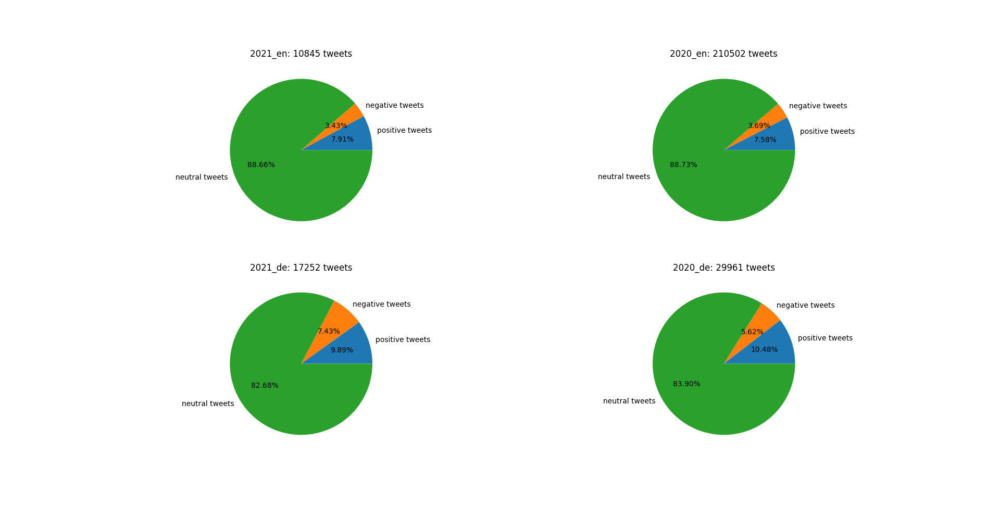
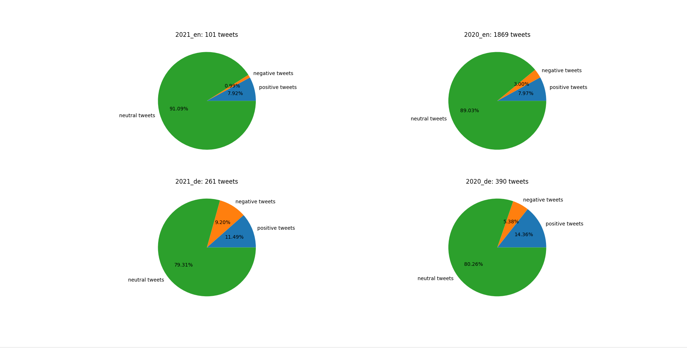
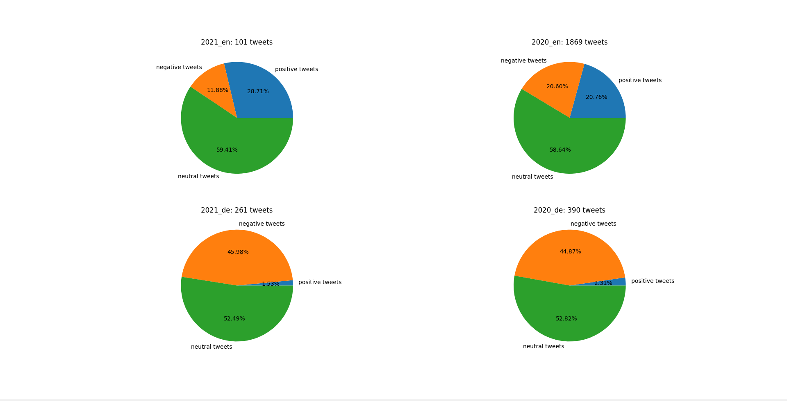

# PROJECT TITLE
This project is a implemented as a student project of the course Intelligent Information Systems.
The aim is to compare the sentiment of tweets from the 15.03.2020 and 15.03.2021. 
For this I downloaded the corresponding tweets and use two pretrained classifiers for gaining the sentiment.
In the end the results are compared by plotting them in a pie diagram.

# Scraping Tweets
For scraping the tweets of the 15.03.2020 and 15.03.2021 I use the tool [Twint](https://github.com/twintproject/twint).
With Twint I scrape multiple metadata. 
The following metadata of every tweet are considered:

- id: id of tweet	
- created_at: timestamp of creation of tweet (e.g. 2020-03-15 16:05:20 Central European Time)	
- date: here 15.03.2020	
- time: e.g. 16:05:20 			
- tweet: the actual tweet	
- language: language prefix (e.g. "en" for English)	
- replies_count: number of replies to this tweet	
- retweets_count: number of retweets of this tweet
- likes_count: number of likes of this tweet

I search for all tweets which include the term: "corona".

Note that the scraping tool Twint uses the Western European Time, but I save them in the Central European Time.
Therefore, the hour at 15.3. from 0:00 to 1:00 doesn't occur in my dataset but on the other hand the hour from 0:00 to 1:00 at 16.3.
The scraping is implemented in [twint_search.py](./twint_search/twint_search.py).
The scraped data can be found in the folders [data_corona_15_03_en](./data_corona_15_03_en) and [data_corona_15_03_de](./data_corona_15_03_de).

## Problems by scraping
Unfortunately, the tool [Twint](https://github.com/twintproject/twint) doesn't work properly. 
I defined that only english tweets should be scraped, but the tool doesn't takes this into account and scraped all tweets.
Therefore, I had to preprocess the scraped data and implement a function which sorts our the non-english tweets.
Because of this circumstances I also consider german tweets in my analysis by sorting out all non-german tweets.

# Preprocessing

# Experiments
...

    positive sentiment: compound score >= 0.5
    neutral sentiment: (compound score > -0.5) and (compound score < 0.5)
    negative sentiment: compound score <= -0.5
    

## Experiment 2

In the second experiment I use the [SentimentIntensityAnalyzer](https://www.nltk.org/api/nltk.sentiment.html?highlight=sentimentintensityanalyzer#nltk.sentiment.vader.SentimentIntensityAnalyzer) of the [nltk](https://www.nltk.org/) library. 

...

So I run through each tweet and calculate the [polarity score](https://www.nltk.org/api/nltk.sentiment.html?highlight=polarity%20score#nltk.sentiment.vader.SentimentIntensityAnalyzer.polarity_scores). 
The polarity score results among other measurements the compound score. 

## Experiment 3
# Future work
maybe covid instead of corona
